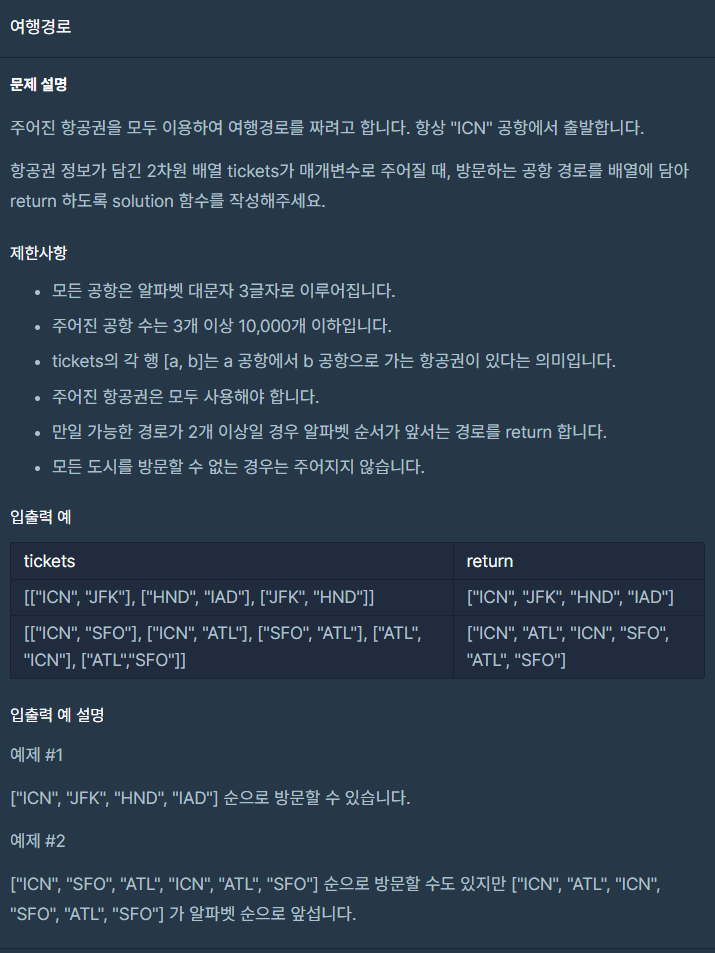

## 프로그래머스 - 여행경로(Java) ##



### 풀이

모든 티켓을 이용하여 경로를 완성시켜야 하고 순서에 따라 다른 결과가 나오기 때문에 순열을 사용하여 모든 경우를 만들어 보면 됩니다. 

처음 생각해 보아야 하는 점은 **티켓의 재사용가능 여부**입니다.

넘어온 tickets 배열에서 티켓을 사용하면 그 티켓은 다시 사용할 수 없습니다. 이 문제 뿐만 아니라 노드들을 연결하는 그래프 문제나 트리형태의 자료구조를 탐색하는 문제에서는 원소를 배치하면 그 원소를 다시 사용할 수 없는 경우가 많습니다. 이런경우에 원본 배열을 수정하거나 복사해서 원소를 제거하는 것보다는 그 원소의 사용여부에 대한 정보를 저장하는 컬렉션을 이용하면 편리합니다.

이 문제에서는 티켓들의 사용여부를 저장하는 배열을 만들어서 구현을 할 것입니다.

다음으로 생각해볼 것은 **탐색의 깊이**입니다.

위 문제의 \[예제 1\]을 깊이 형태로 표현하면 다음처럼 표현할 수 있습니다.

> ICN - JCK - HND - IAD

티켓을 하나 사용하면 자료구조의 깊이가 한 단계 깊어집니다.

순열로 표현하면 4개의 자리에 4명을 배치하는 경우의 수에서 가장 앞자리가 고정 되어있는 문제와 비슷한 형태로 볼 수 있습니다.

경우의 수를 하나 구할 때마다 이 자리배치 순서에 대한 정보를 저장하기 위한 자료구조가 필요합니다.

그리고 이 자료구조는 결국 문제에서 원하는 정답에 해당됩니다.

저는 티켓을 사용할 때마다 편하게 추가하기 위해서 List<String> 형태에 "경로,경로,경로,경로" 이런 구조로 추가한 다음에 마지막에 문제에서 요구하는 String\[\] 형태로 변환시켜주겠습니다.

마지막으로 **티켓을 사용할 수 있는 조건**에 대해서 생각해 보아야 합니다.

내가 티켓을 사용하면 내 현재위치가 티켓의 목적지로 변경됩니다. 그리고 모든 티켓 중 출발지가 내가 이전에 사용한 티켓의 목적지와 같아야만 사용할 수 있습니다.

그리고 처음에 이야기한 티켓의 사용여부를 저장하고 있는 공간에서 사용여부를 확인해서 아직 사용하지 않은 티켓만 사용할 수 있습니다.

위 3가지 문제를 중점적으로 코드를 보면 좋을 것 같습니다.

### 소스코드

```
import java.util.*;

class Solution {
    
    List<String> list = new ArrayList<>();
    private boolean[] useTickets;
    
    public String[] solution(String[][] tickets) {
    
        useTickets = new boolean[tickets.length];
        
        dfs(tickets, 0, "ICN", "ICN");
        
        Collections.sort(list);
        
        return list.get(0).split(",");
    }
    
    private void dfs(String[][] tickets, int depth, String from, String path) {
        if(depth == tickets.length) {
            list.add(path);
            return;
        }
        
        for(int i=0; i<tickets.length; i++) {
            if(!useTickets[i] && tickets[i][0].equals(from)) {
                useTickets[i] = true;
                dfs(tickets, depth + 1, tickets[i][1], path + "," + tickets[i][1]);
                useTickets[i] = false;
            }
        }
        
    }
}
```