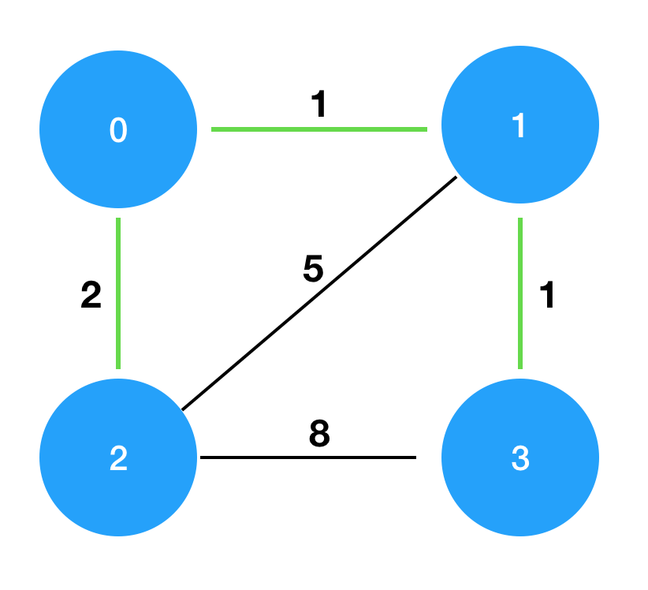
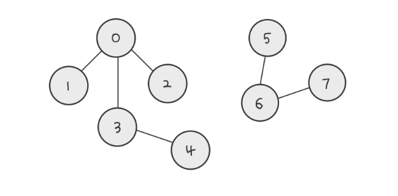
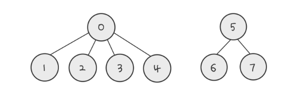
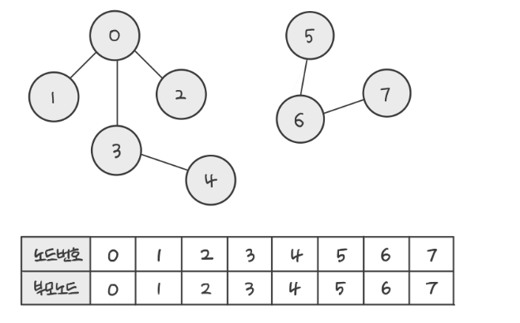
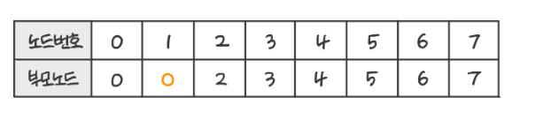
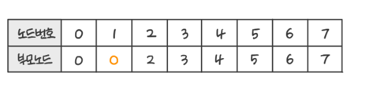
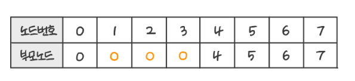
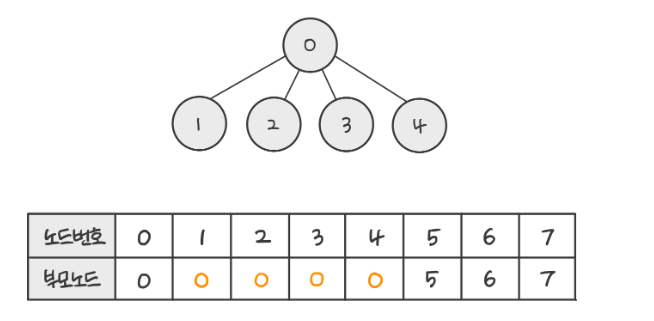
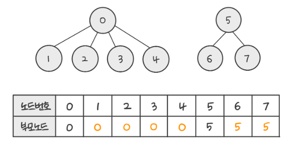

### 문제 ###

n개의 섬 사이에 다리를 건설하는 비용(costs)이 주어질 때, 최소의 비용으로 모든 섬이 서로 통행 가능하도록 만들 때 필요한 최소 비용을 return 하도록 solution을 완성하세요.


다리를 여러 번 건너더라도, 도달할 수만 있으면 통행 가능하다고 봅니다. 예를 들어 A섬과 B 섬 사이에 다리가 있고, B 섬과 C 섬 사이에 다리가 있으면 A섬과 C섬은 서로 통행 가능합니다.

#### 제한사항 ####

섬의 개수 n은 1 이상 100 이하입니다.
costs의 길이는 ((n-1) * n) / 2이하입니다.
임의의 i에 대해, costs[i][0] 와 costs[i][1]에는 다리가 연결되는 두 섬의 번호가 들어있고, costs[i] [2]에는 이 두 섬을 연결하는 다리를 건설할 때 드는 비용입니다.
같은 연결은 두 번 주어지지 않습니다. 또한 순서가 바뀌더라도 같은 연결로 봅니다. 즉 0과 1 사이를 연결하는 비용이 주어졌을 때, 1과 0의 비용이 주어지지 않습니다.
모든 섬 사이의 다리 건설 비용이 주어지지 않습니다. 이 경우, 두 섬 사이의 건설이 불가능한 것으로 봅니다.
연결할 수 없는 섬은 주어지지 않습니다.

#### 입출력 예 ####
```
n    costs                                      return  
4    [[0,1,1],[0,2,2],[1,2,5],[1,3,1],[2,3,8]]	  4
```


#### 입출력 예 설명 ####

costs를 그림으로 표현하면 다음과 같으며, 이때 초록색 경로로 연결하는 것이 가장 적은 비용으로 모두를 통행할 수 있도록 만드는 방법입니다.




#### 풀이 ####
방향이 존재하지 않고, 간선에 가중치가 있으며, 모든 정점을 최소비용으로 연결하는 문제입니다.
그래서 최소 신장 트리(Minimum Spanning Tree)가 떠올랐고, 최소 신장 트리에서 최소비용을 구하는 방법은 2가지가 있습니다.
정점을 기준으로 최소 비용을 찾는 프림 알고리즘과 간선을 기준으로 최소비용을 찾는 크루스칼 알고리즘이 있습니다.
두 알고리즘 모두 욕심쟁이 기법을 기반으로 합니다.
욕심쟁이 기법은 선택의 순간마다 가장 이득이 되는 선택을 하는 기법입니다. 순간마다 가장 이득이 되는 선택이 모이면 전체에서도 가장 이득이 된다는 것을 전제로합니다.
모든 경우에 그런 것은 아니지만 최소 신장 트리에서 이 전제는 사실입니다.

프림 알고리즘은 임의의 정점을 선택하고 그 정점과 연결된 간선 중 최소 비용을 가지는 간선을 선택하면서 최소비용을 더해나가는 알고리즘입니다.
정점의 기준에서 선택할 수 있는 최선의 선택으로 정점과 연결된 간선들 중 가장 낮은 비용의 간선을 선택을 하기때문에 욕심쟁이 기법에 포함됩니다.

크루스칼 알고리즘은 모든 간선들을 가중치의 오름차순으로 정렬한 뒤에 사이클을 형성하지 않는 간선들을 선택하여 최소비용을 구하는 알고리즘입니다.
가장 낮은 간선들을 선택하면서 최소비용을 계산하기 때문에 욕심쟁이 기법에 포함됩니다.

이 중 크루스칼 알고리즘으로 이 문제를 해결해보도록 하겠습니다.

costs 배열은 출발하는 섬의번호, 도착하는 섬의번호, 다리의 비용으로 구성되어있습니다.
쉽게 표현하면 다리에 대한 정보라고 볼 수 있습니다. 그래프에서는 두 노드를 연결하는 간선에 대한 정보라고 표현할 수 있습니다.

그래서 우선적으로 이 간선들에 대한 집합체인 costs 배열을 간선의 비용의 오름차순으로 정렬해줍니다.
```java
Arrays.sort(costs, Comparator.comparingInt((int[] c) -> c[2]));
```

다음에는 전체 배열을 순회하면서 이 간선들의 비용을 더해나갈 것입니다.
오름차순으로 정렬되어 있기때문에 Greedy 기법에 따라 그냥 더하면됩니다.
```java
for(int[] edge : costs) {
            int from = edge[0];
            int to = edge[1];
            int cost = edge[2];

            total += cost;
            parent[toParent] = fromParent;
            
        }
```

이렇게만 하면 사이클을 만드는 간선이 제외되지 않아 우리가 원하는 최소비용을 구할 수 없습니다.
그래서 사이클을 만드는 간선은 제외해 주어야합니다.
그렇다면 사이클을 만드는 간선을 어떻게 제외해야 할까요?
Union Find 라고 하는 합집합 찾기 방법이 있습니다. Disjoint-Set 알고리즘이라고도 합니다.

두 임의의 원소를 선택했을 때 그 두원소가 같은 집합에 속하는지 판별하는 방법입니다.
그래프를 기준으로 생각하면 임의의 두 노드가 같은 그래프에 속하는지 판별하는 방법입니다.



위 2 그래프에서 노드 2와 노드4가 같은 그래프에 있는 지 확인하고 싶다고 가정해 보겠습니다.
우리는 2에서 0으로, 0에서 3으로 가고 마지막으로 3과 연결된 4를 보고 같은 그래프에 있다는 사실을 확인할 수 있습니다.
하지만 이렇게 찾으면 2와 4사이에 노드가 엄청나게 많아진다면 아주 오랜 시간이 걸릴 것입니다.
그래서 각 집합의 대표(부모)를 정하고, 원소들이 대표를 가르키도록 합니다.



이렇게 하면 같은 부모를 가진 노드들은 같은 그룹에 속한다는 것을 알 수 있습니다.
그리고 대표자가 2개 있으면 그래프가 총 2개라는 사실도 알 수 있습니다.
또한 일반적으로 그래프 내에서 가장 작은 값을 가진 노드를 부모로 선택합니다.

예시 그래프에서 Union Find가 어떻게 동작하는지 살펴보겠습니다.



먼저 노드들의 부모를 저장할 공간을 만들고, 처음에는 자기 자신을 부모로 초기화합니다.



0 과 1은 연결되어있기 때문에 같은 부모를 가지고 있다고 표현할 수 있습니다. 부모를 합치겠습니다.(Union)
여기서 0과 1 둘중에 일반적으로 작은 값을 부모로 선택합니다.



2와3도 0과 연결되어 있기 때문에 부모를 0으로 합칠 수 있습니다.



3과 연결된 4는 0과 직접적으로 연결되어 있지 않습니다.
하지만 3과 연결되어 있기 때문에 4의 부모는 3의 부모와 합칠 수 있습니다.
그런데 3의 부모를 보니 0을 가리키고 있습니다.
그래서 0의 부모를 살펴보니 0의 부모는 자기자신입니다.
부모가 자기자신이라는 말은 자기가 이 그래프의 대표라는 것을 의미합니다.

다시 4로 돌아가서 최종적으로 4의 부모는 3의부모와 같고 3의 부모는 0이므로 4의 부모도 0이됩니다.



4의 사례에서 알 수 있는 것처럼 Union Find는 자기 자신을 부모로 가지는 노드를 찾을 때까지 깊이 탐색을 하게됩니다.
코드로 작성한다면 자기자신을 반환하는 노드를 찾을 때까지 재귀호출을 하는 형태로 구현이 가능합니다.

마지막까지 과정을 진행하면 아래와 같은 그림이 됩니다.




문제로 돌아가서 Union Find를 통해서 사이클을 형성하는 간선은 선택하지 않도록 하겠습니다.
간선을 이루는 두 노드가 같은 부모를 가지고 있다면 비중이 낮은 간선 하나만 추가하면 됩니다.
왜냐하면 같은 부모를 가진다는 말은 두 노드가 연결이 되어있다는 의미이고, 이미 연결된 두 노드를 다시 연결하게 되면 사이클이 형성됩니다.
사이클이 형성된다는 것은 두 노드를 연결하는 여러개의 간선이 있어 최소비용을 구하는 데 불필요한 간선이 존재한다는 의미입니다.
이제 이 내용을 코드로 구현해보겠습니다.

먼저 부모에 대한 정보를 저장할 공간을 만들고 초기화해주겠습니다.
```java
int[] parent;

        parent = new int[n];

        for(int i=0; i<n; i++) {
        parent[i] = i;
        }
```
위에서 이야기한대로 부모의 정보를 저장하는 배열의 초기값은 처음에는 자기자신으로 초기화해줍니다.
최종결과 코드에서는 클래스내의 다른 함수에서도 접근할 수 있도록 클래스의 필드로 선언하였습니다.


```java
        for(int[] edge : costs) {
            int from = edge[0];
            int to = edge[1];
            int cost = edge[2];

            int fromParent = findParent(from);
            int toParent = findParent(to);

            if(fromParent == toParent) continue;

            total += cost;
            parent[toParent] = fromParent;
        }
```
다음에는 
위 코드를 보면 from과 to, 두 노드를 findParent라는 함수를 통해서 각 노드의 부모를 구하고 만약 부모가 같다면 다음 간선에 대해서 검사하도록 했습니다.
같지 않다면 전체 비용을 의미하는 total에 비용을 더해주고, 두 노드가 연결되었다는 의미로 parent 배열의 두 노드의 부모를 같게 해줍니다.

```java
    private int findParent(int node) {
        if(parent[node] == node) return node;
        return parent[node] = findParent(parent[node]);
    }
```
findParent()는 만약 전달받은 노드의 부모노드가 자기자신이라면 그대로 반환하고, 아니라면 자기자신이 부모노드인 노드를 찾을 때가지 재귀호출을 합니다.
이렇게 하면 그래프내에서 노드가 많아지더라도 가장 상위의 부모를 찾을 수 있습니다.

이제 가중치가 낮은 간선들 중에서 사이클을 만드는 간선을 제거했으므로, 최소비용을 구할 수 있습니다.
하지만 코드상에서는 costs의 모든 원소를 순회하기 때문에 불필요한 부분이 발생합니다.
이미 최소비용을 이루는 모든 간선을 순회했음에도 costs 배열을 끝까지 순회합니다.
사실, 간선을 가중치의 오름차순정렬을 했기때문에, 최소비용을 만족하는 간선의 개수를 충족시킨 이후에는 순회할 필요가 없습니다.
costs 배열의 원소가 많아진다면(간선이 많아진다면) 효율이 떨어지게 될것입니다.
그래서 이 부분을 개선해 주도록 하겠습니다.

```java
int selectedEdgeCount = 0;

        for(int[] edge : costs) {
            int from = edge[0];
            int to = edge[1];
            int cost = edge[2];

            int fromParent = findParent(from);
            int toParent = findParent(to);

            if(fromParent == toParent) continue;

            total += cost;
            parent[toParent] = fromParent;

            selectedEdgeCount++;
            if(selectedEdgeCount == n -1) break;
        }
```
for문 바깥에 현재까지 선택된 간선의 개수를 계산하는 selectedEdgeCount 를 선언하고, 간선을 선택할때마다 하나씩 증가시켜주겠습니다.
그리고 선택된 간선의 개수가 전체노드의 개수 - 1개가 되었을 때 반복문을 탈출합니다.
여기서 선택된 간선의 개수가 전체노드의 개수 - 1개라는 의미는, 모든 노드를 연결하는 그래프가 완성되었다는 것을 의미합니다.
n개의 점을 연결하는 직선의 최소 개수는 n-1개이기 때문입니다.

이렇게 최종코드가 완성되었습니다.

``` java
public class MinimumSpanningTree {
    int[] parent;

    public int solution(int n, int[][] costs) {
    
        
        Arrays.sort(costs, Comparator.comparingInt((int[] c) -> c[2]));

        parent = new int[n];

        for(int i=0; i<n; i++) {
            parent[i] = i;
        }

        int total = 0;
        int selectedEdgeCount = 0;

        for(int[] edge : costs) {
            int from = edge[0];
            int to = edge[1];
            int cost = edge[2];

            int fromParent = findParent(from);
            int toParent = findParent(to);

            if(fromParent == toParent) continue;

            total += cost;
            parent[toParent] = fromParent;

            selectedEdgeCount++;
            if(selectedEdgeCount == n -1) break;
        }
        return total;
    }

    private int findParent(int node) {
        if(parent[node] == node) return node;
        return parent[node] = findParent(parent[node]);
    }

}
```

