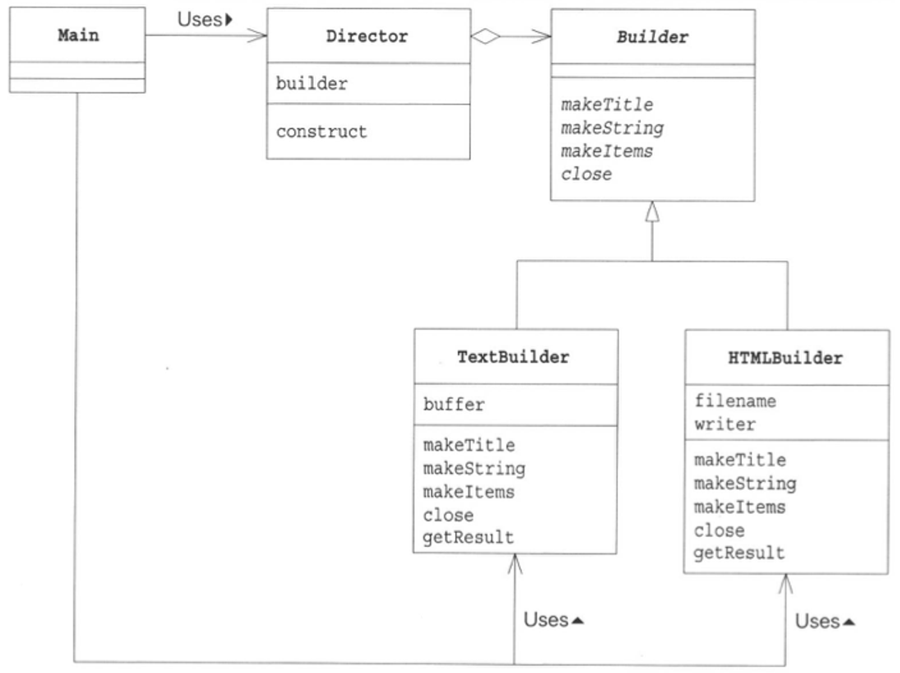

## Builder Pattern ##
빌더 패턴은 Lombok에서 클래스를 생성할 때 원하는 인자만으로 클래스를 객체를 생성하기 위해 @Builder 어노테이션을 선언해 많이 활용한 패턴이었습니다.
또한 이펙티브 자바에서도 '생성자의 매개변수가 많을 경우 빌더를 고려하라' 라는 내용도 있어서 많이 활용해왔습니다.
이펙티브 자바나 여러가지 글들을 통해 빌더패턴이 어떻게 구성되어 있는지는 알고는 있었지만 개발할때는 번거롭거나 속도를 이유로 어노테이션을 선언하면서 구성과 원리를 잊고 있었던 듯해 이번에 디자인패턴을 정리하면서 다시 한 번 정리하게되었습니다.

평소에 습관적으로 VO를 생성할 때 @Builder 어노테이션만 선언해 사용하다 보니, 많은 인수를 가지고 있는 클래스의 객체를 생성할 때 불변성을 보장한다는 장점 외에도 유연한 확장이 가능하다는 장점은 잘 떠올리지 못했던 것 같습니다.
그래서 이번 예제는 빌더패턴의 유연함에 집중한 것을 가져왔습니다.
Main 클래스에서 Director 객체를 생성할 때, Main 클래스는 Builder 클래스를 호출하지도 않고 Builder 클래스에 대해 알지도 못합니다.
또한 Director 클래스는 Builder 클래스를 필드로 가지고 있고, 구체적인 로직을 알고 있지만 실제로 문서를 만들 때 사용하는 빌더가 TextBuilder인지, HTMLBuilder인지 알지 못합니다.
Director 클래스를 사용하는 Main 클래스는 상황이나 조건에 따라 원하는 빌더를 선택해 문서를 생성할 수 있습니다.

객체 지향 프로그래밍에서는 결합도는 낮추고 응집도는 높이는 것이 중요합니다.
그래서 각각의 클래스는 자신의 역할에 대한 정보를 알고 있어야 하며, 자신의 역할 밖의 정보에 대해서는 모르게 설계해야 응집도는 높아지고 결합도는 낮아집니다.
여기서 문서를 작성하는 구체적인 로직은 Builder 클래스를 상속한 HTMLBuilder와 TextBuilder가 담당하고, Director 클래스는 문서를 작성하는 구체적인 로직은 모르지만 Builder 클래스를 활용해 문서를 만드는 역할을 합니다.
Main 클래스에서는 인자에 따라 어떤 Builder를 사용할 지에 대한 정보를 가지고 Director 클래스에게 문서 만드는 일을 시킵니다.

이렇게 하면 나중에 HTML과 text외에 XML 형식의 문서를 만들고 싶거나 JSON 형태의 문서를 만들어야 하는 상황에서도 XMLBuilder, JSON 빌더 클래스만을 추가하고 Main 클래스에서는 새로운 빌더로 Director 클래스를 생성하기만 하면 됩니다.
이런일이 가능한 이유는 빌더패턴을 이용해서 Main 클래스가 문서를 작성하는 로직에 대해 관여하지 않아 의존성이 없기 때문입니다.
이것을 '결합도가 낮다' 라고 부를 수 있습니다.

우리가 디자인 패턴에 대해서 공부하는 이유도 이런 것이 아닐까 싶습니다.
동일한 기능을 구현하더라도 디자인 패턴에 따라 객체지향적인 코드를 작성하게 되면, 애플리케이션에 새로운 요구사항이 생겼을 때 빠르게 대응할 수 있습니다.
빌더패턴도 객체지향 프로그래밍에서 소개하는 디자인 패턴의 하나로, 유연한 프로그래밍을 통해 '수정에는 닫혀있어야 하고, 확장에는 열려있어야 한다.' 라는 객체지향 프로그래밍의 5대 원칙 중 OCP를 충족시키는 사례를 생각해보았습니다.

