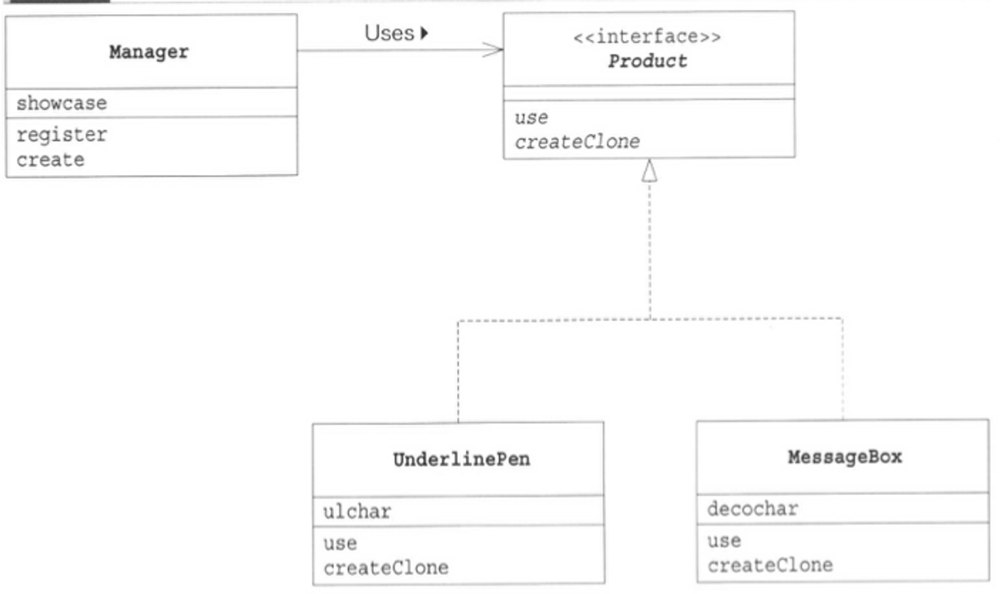

## 프로토타입 패턴 ##

평소 개발을 하면서 새로운 객체가 필요할 때는 new 연산자를 통해서 생성했었고, 서버에서 JPA 엔티티를 생성한 결과를 클라이언트에 반환하는 경우에도 dto 클래스를 만들었기때문에 프로토타입패턴을 활용한 경험은 거의 없습니다.
하지만 관련 예제와 유용한 경우를 살펴보니 여태까지 작성한 코드들 중에서도 프로토타입패턴을 적용할 수 있지만 생각하지 못했던 부분들이 있었던 것 같습니다.

예를 들면, 복잡한 작업을 거쳐 만들어지는 객체는 사용자 편의를 위해서 '프리셋'이라고 하는 기본 설정값을 제공하는 경우가 많습니다.
게임에서 플레이어의 캐릭터를 생성하는 경우 플레이어의 눈썹 모양, 얼굴 형, 머리색, 눈동자 등 다양한 설정값들이 모여 생성되는 것이 대표적인 예라고 할 수 있습니다.
그런 경우 매번 새로운 인자값으로 인스턴스를 생성하는 것보다 지금 만든 인스턴스를 저장해두고 등록된 인스턴스를 복사해 새로운 인스턴스를 만드는 것이 더 좋을 때도 있습니다.
이런 부분들에 프로토타입패턴을 적용해서 개발했었더라면 좀 더 시간을 절약하고 생산성을 높일 수 있었을 것이라는 생각이 듭니다.

프로토타입 패턴이 활용되는 유스케이스를 정리해두고 다음에 비슷한 문제를 만나면 패턴 적용을 적극적으로 고려해볼 것 같습니다.

+ <b>종류가 너무 많아 클래스로 정리되지 않는 경우</b>  
    => 취급하는 오브젝트의 종류가 너무 많아서 각각을 별도의 클래스로 만들어 다수의 소스 파일을 작성해야 하는 경우
+ <b>클래스로부터 인스턴스 생성이 어려운 경우</b>  
    => 생성하고자 하는 인스턴스가 복잡한 작업을 거쳐 만들어지기 때문에 클래스로부터 만들기가 매우 어려운 경우
+ <b>framework와 생성할 인스턴스를 분리하고 싶은 경우</b>  
    => 인스턴스를 생성할 때의 framework를 특정 클래스에 의존하지 않도록 만들고 싶은 경우.  
이와 같은 경우 클래스의 이름을 지정해서 인스턴스를 만드는 것이 아니라 이미 '모형' 이 되는 인스턴스를 등록해 두고, 그 등록된 인스턴스를 복사해서 인스턴스를 생성