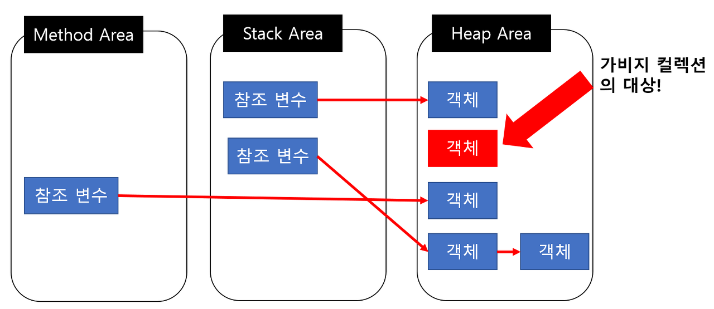
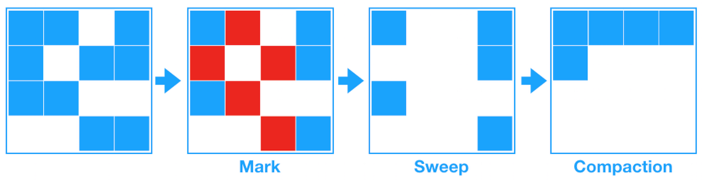
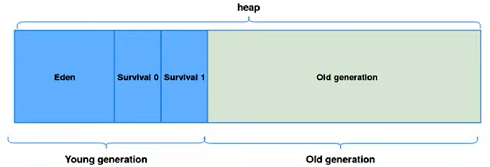
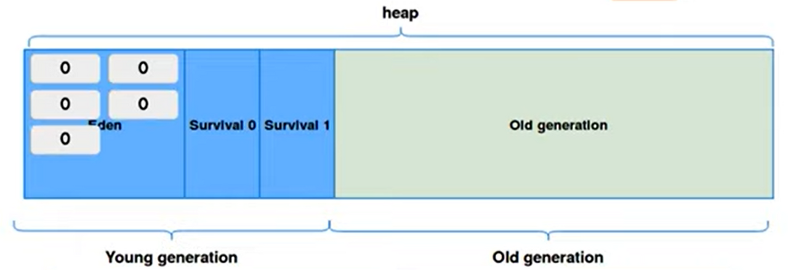
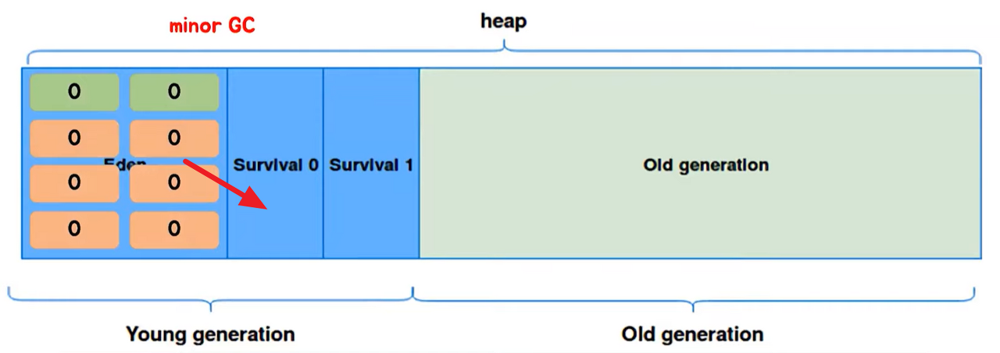
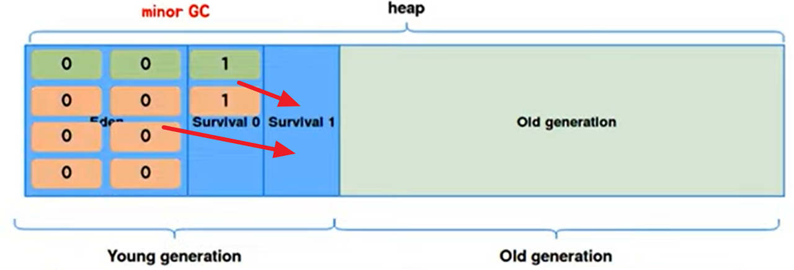
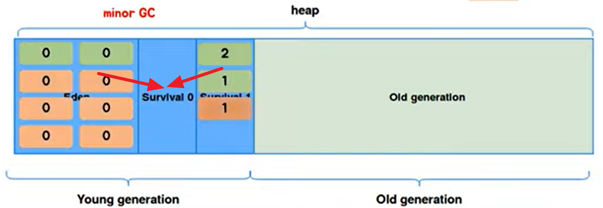
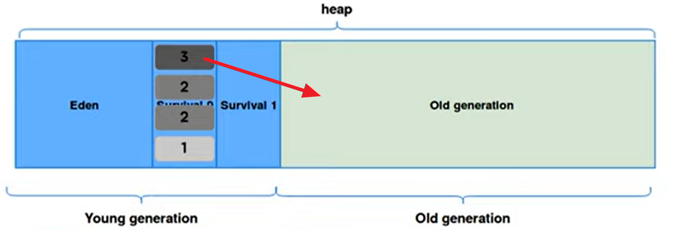
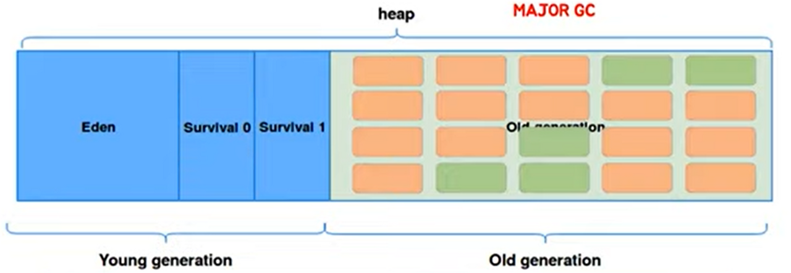

# Garbage Collection #

## 개념 ##

JAVA로 작성한 코드를 컴파일하고 실행하려면 CPU로부터 메모리를 할당받아야합니다.
Java는 JVM에서 이 과정을 수행합니다. 그리고 JVM에서 CPU로부터 메모리를 할당받습니다. 하지만 실행될 프로그램에서 사용될 메모리를 미리 정확하게 할당하기는 어렵습니다.
실행환경에 따라 필요한 메모리는 동적으로 변화하기 때문입니다. 그래서 JVM은 메모리를 동적으로 할당받습니다.
그리고 동적으로 할당했던 메모리 영역 중 필요 없게 된 메모리 영역을 주기적으로 삭제합니다. 이것을 Garbage Collection이라고 부릅니다.
C나 C++같은 프로그래밍언어에서는 Garbage Collection과 같은 일을 하는 요소가 없어서 개발자가 직접 필요한 순간마다 메모리할당과 해제를 해줘야합니다.
그래서 개발자 입장에서 Java를 이용해서 개발을 하게되면 메모리 관리나 메모리 누수를 완벽하게 관리하지 않고 어플리케이션 개발에 집중할 수 있다는 장점이 있습니다.

하지만 GC에도 단점이 존재합니다.
JVM에서 메모리 관리를 담당하기때문에 개발자는 메모리가 정확히 언제 해제되는지 알 수 없고, GC는 내부 구조적으로 GC가 동작하는 동안, GC가 동작하는 스레드를 제외한 다른 스레드들이 정지하기때문에 오버헤드가 발생한다는 점입니다.
그렇기 때문에, GC가 너무 자주 실행되면 성능 하락으로 이어질 수 있습니다. 또한, 매우 짧은 시간이지만 어플리케이션이 정지하기때문에 반드시 실시간으로 동작하는 시스템에는 적합하지 않습니다.

## Garbage Collection 대상 ##

GC가 메모리에서 객체를 지우는 기준은 도달성(Reachability)입니다.
도달성은 객체에 참조할 수 있는 레퍼런스가 있는지, 아니면 존재하지 없는지에 대한 것을 나타냅니다.
객체가 참조되고 있는 상태를 Reachable, 참조되고 있지 않은 상태를 Unreachable이라고 하며 Unreachable한 객체는 GC의 대상이됩니다.

GC는 Runtime Data Area 에서 Heap 영역에서 동작합니다. 그리고 JVM 메모리에서 객체는 실질적으로 Heap 영역에서 생성되고, Method Area나 Stack Area에서는 Heap Area에서 생성된 객체의 주소를 참조합니다.
Heap 영역에서 생성된 객체는 실행중인 메소드가 종료되는 등의 이벤트가 발생하면 Heap Area 에 존재하는 객체를 참조하고 있는 참조변수가 사라지면 다른 영역에서 참조하고 있지 앟는 객체가 발생합니다.

가비지 컬렉터는 이렇게 Unreachable 상태의 객체들을 메모리에서 제거합니다.

## Garbage Collection 청소방식 ##

### Mark And Sweep ###

Mark And Sweep은 그래프 순회 방식을 이용합니다. 
가장 먼저 Root Space에서부터 시작해 참조하고 있는 객체를 연결시켜 각각 어떤 객체를 참조하고 있는지 마킹합니다.
여기서 Root Space는 Heap 메모리 영역을 참조하는 Method Area, static 변수, stack의 로컬변수, native method stack을 의미합니다.

다음은 참조하고 있지 않은 Unreachable 상태의 객체를 삭제합니다(Sweep)

마지막으로, sweap의 과정을 해서 메모리 중간중간 비어있는 공간들을 압축하기 위해 객체들을 Heap의 시작주소로 모아서 메모리가 할당된 부분과 그렇지 않은 부분으로 압축합니다.(Compact)
마지막 압축과정은 GC 종류에 따라 하지 않는 경우도 존재합니다.

## Garbage Collection 동작 과정 ##

### Heap Area ### 

JVM의 Heap 영역은 다른 영역에서 참조하는 객체들이 저장되는 공간이고, 가비지 컬렉션의 대상이 됩니다.
처음에 Heap 영역이 설계될 때 2가지를 전제하고 설계되었다고 합니다.

> 1. 대부분의 객체는 금방 접근 불가능한 상태(unreachable)가 된다.
> 2. 오래된 객체에서 새로운 객체로의 참조는 아주 적게 존재한다.

이 말은 대부분의 객체가 1회성이고 메모리에 오랫동안 남아있는 경우가 드물다는 것을 말합니다.
이런 특성을 이용해 JVM 개발자들은 효율적으로 메모리를 관리하기 위해 Heap 영역을 Young 과 Old로 나누었습니다.
초기에는 Permanent라고 불리는 영구적인 데이터가 저장되는 공간이 존재했지만, java8 버전부터는 Native Method Stack 영역에 편입되었다고합니다.

#### Young Generation ####
Young 영역은 새롭게 생성된 객체가 할당되는 영역입니다.
대부분의 객체는 금방 unreachable 상태가 되므로 많은 객체가 생성되었다가 사라집니다.
Young 영역에서 일어나는 GC를 Minor GC라고 합니다.
또한, Young 영역은 3가지 영역으로 구분됩니다.

Eden : new 연산자를 통해 새로 생성된 객체가 위치하고, minor GC가 일어난 뒤 살아남은 객체들은 Survivor 영역으로 보냅니다.
Survivor 0 / Survivor 1 : 최소 1번 이상의 GC에서 살아남은 객체가 존재하는 영역입니다. Survivor 영역에는 특별한 규칙이 있는데, 하나의 영역에 객체가 존재할 때 다른 영역은 반드시 비어있어야 한다는 것입니다.  

#### Old Genration ####

Young 영역에서 일정회수 이상의 Minor GC에서 살아남은 객체들을 복사하여 Old 영역에 보관합니다.
Young 영역보다 크게 할당되는데, 수명이 길고 큰 객체들이 Old 영역에 할당되기 때문입니다.
이곳에서 일어나는 GC를 Major GC 또는 Full GC 라고 합니다.

### Minor GC ###

객체가 처음 생성되면 Eden 영역에 age-bit 라고 하는 Minor GC에서 살아남은 횟수를 의미하는 정보를 헤더에 기록하고 할당합니다.

객체를 Eden에 생성하다보면 어느 순간 Eden이 가득차게 되고 이 때 Minor GC가 일어납니다. 여기서 참조되지 않는 객체들은 삭제되고 참조되는 객체들은 Survivor 0 으로 이동됩니다.(Mark and Sweep)
그리고 Survivor 0으로 이동된 객체들의 age-bit가 1이 증가합니다.

비워진 Eden에 다시 객체들이 생성되면서 가득차면 또 한번 Minor GC가 일어납니다. Eden에서 살아남은 객체와 이전 Minor GC에서 살아남은 Survivor 0에 존재하는 객체들은 Survivor 1로 이동됩니다.

Eden이 또다시 가득차게 되면 Minor GC가 일어나면서 위 과정이 반복됩니다. 

위 과정을 반복하다 age-bit가 JVM에서 설정한 임계값을 넘어간 객체는 Old 영역으로 이동됩니다. 이 과정을 Promotion이라고 합니다.
age-bit의 임계값은 JVM마다 다르지만 일반적인 HotSpot JVM의 경우 기본 임계값이 31입니다.
이유는 객체 헤더에 age를 기록하는 부분이 6bit로 이루어져 있기때문입니다.

### Major GC ###

Old 영역에는 임계값에 도달해 이동된 객체들이 존재합니다. 시간이 지나면 Old 영역도 가득차게 되고, 이 때 Major GC가 발생합니다.
가비지 콜렉터는 Old 영역에 있는 모든 객체들을 검사하여 참조되고 있지 않은 객체들을 한꺼번에 삭제합니다.
하지만 Old 영역은 Young 영역에 비해 공간이 크므로 메모리상에서 객체를 제거하는 일에 많은 시간이 소요됩니다.

일반적으로 Minor GC는 크기가 작기 때문에 보통 0.5 ~ 1초정도의 시간이 걸리지만 Major GC는 10배 이상의 시간이 걸린다고합니다.
그래서 Minor GC는 애플리케이션의 성능에 크게 영향을 끼치지 않지만 Major GC는 성능에 영향을 끼칩니다.
Major GC가 실행되는 동안 다른 스레드가 정지하고 Mark and Seep 작업을 해야해서 CPU에 부하를 줘 멈추거나 버벅이게 됩니다.
이런 현상을 Stop-the-World라고 합니다.

그래서 JVM 개발자들은 스레드가 멈추는 시간을 최소화하기 위해 계속해서 가비지 컬렉션 알고리즘을 발전시켜왔습니다.
다음 글에서 가비지 컬렉션 알고리즘 종류들에 대해서 알아보도록 하겠습니다.