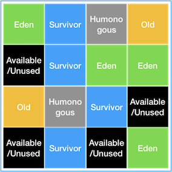

# Garbage Collection 종류 #

## 개요 ##
[Garbage Collection - 1]('https://github.com/sungwoon129/blog-code/tree/main/Garbage-Collection-1')에서 가비지 컬렉션의 절차에 대해서 이야기 했었습니다.
가비지 컬렉션을 하는 과정에서 Stop The World 현상이 발생하고 애플리케이션이 지연되는 시간이 있다고 이야기했습니다.
지연현상은 자바의 발전과 애플리케이션의 크기가 증가하면서 Heap 영역의 크기가 커졌고, Heap 영역을 비우는 시간이 길어졌습니다.

가비지 컬렉션에서도 애플리케이션 지연현상을 줄이기 위해 많은 변화가 있었습니다.
가비지 컬렉션은 결국 Heap 영역에 쌓인 데이터를 어떻게 지울것인가에 대한 고민입니다.
그래서 이를 최적화하기 위한 다양한 알고리즘이 나타났고, 이 글에서는 이 알고리즘들에 대해서 이야기하겠습니다.

## Serial GC ##

Young 영역에서의 GC(Minor GC)는 [Garbage Collection - 1]('https://github.com/sungwoon129/blog-code/tree/main/Garbage-Collection-1')에서 소개한 Mark-Sweep 방식을 이용하고, Old 영역에서의 GC(Major GC)는 Mark-Sweep-Comapct 방식을 이용합니다.

살아 있는 객체를 마킹하고,나머지를 제거한 후 메모리의 앞 공간부터 순서대로 배치해 압축시키는 과정을 반복합니다.
하지만 이 알고리즘은 GC를 처리하는 쓰레드가 1개이기 때문에 앞으로 소개할 알고리즘들 중 stop the world 시간이 가장 깁니다.
그래서 실무에서 사용하는 경우는 거의 없고, 디바이스 성능의 한계로 CPU코어가 한개인 경우에만 사용합니다.

## Parallel GC ##

기본적으로 Serial GC와 동일한 알고리즘을 사용합니다. 하지만 Serial GC는 GC를 처리하는 스레드가 1개인 반면, Parallel GC는 GC를 처리하는 스레드가 여러개입니다.
그리고 Young 에서 발생하는 Minor GC에 대해서만 멀티스레드로 처리되고, old 영역에서는 여전히 싱글 스레드로 처리합니다.
멀티스레드에서 병렬적으로 GC를 수행하기 때문에 Serial GC보다 상대적으로 GC 처리속도가 빠르고 stop the world의 시간이 짧습니다.
Java 8에서 기본적으로 채택한 GC입니다. 기본적으로 CPU 코어의 개수만큼 GC 스레드를 할당합니다.

## Parallel Old GC ##

앞에서 이야기한 Parallel GC를 개선한 버전입니다. Parallel GC에서는 Young 영역에서만 멀티스레드로 처리했지만, Old 영역에서 발생하는 GC도 멀티스레드로 처리합니다.
알고리즘에도 변화가 생겼습니다. 기존에는 Mark-Sweep-Comapct 방식을 이용했었는데, Old 영역에서 객체를 메모리의 앞부분에서부터 배치하는 것이 멀티스레드 환경에서는 어려움이 있었습니다.
그래서 Parallel GC에서도 Major GC는 싱글스레드로 처리되고 있었지만 알고리즘을 개선해 문제를 해결했습니다.
여기서 사용된 알고리즘이 Mark-Summary-Compact 방식입니다. Summary 단계에서 앞서 GC를 수행한 영역에 대해서 별도로 살아있는 객체를 식별한다는 점이 기존의 Sweep과 다른 점이고 조금 더 복잡합니다.

## CMS GC(Concurrent Mark Sweep) ##

멀티스레드를 사용하면서, 어플리케이션의 스레드와 GC 스레드가 동시에 실행되어 stop the world 시간을 최대한 줄이기 위해 고안된 GC입니다.
어플리케이션이 실행되는 동안에 GC와 리소스를 공유할 수 있도록 구현되었습니다. 
즉, 어플리케이션과 GC 스레드가 동시에 실행되어 자원을 공유함으로써 stop the world의 시간을 최소화시키는 것이 주목적인 GC입니다.

초기 initial Mark 단계에서는 GC Root에서 직접적으로 참조하는 객체만 마킹합니다. 이 과정에서 stop the world가 발생하지만 깊이가 얕으므로 시간이 매우 짧습니다. 
이전 글에서 GC가 더 이상 사용하지 않는 객체를 찾기 위해서 Tree 구조를 사용한다고 이야기했습니다.
그리고 Tree의 가장 꼭대기 부분을 GC Root라고 한다고 했습니다.
initial Mark에서는 GC Root와 1차적으로 연결되는 객체만 찾아 참조가 유지되고 있는지 판단한다는 의미입니다.

다음 Concurrent Mark 단계에서는 initial Mark 단계에서 제거되어야 하는 대상으로 판별된 객체들이 참조하는 다른 객체들을 tree를 따라가며 GC 대상인지 확인합니다.
이 단계는 stop the world 현상없이 다른 스레드가 실행중인 상황에서 동시에 진행됩니다.

Remark 단계에서는 이전 Concurrent Mark 단계에서 GC 대상으로 새로 추가되거나 참조가 끊긴 객체를 확인합니다.
즉, Concurrent Mark단계의 결과를 검증하는 단계입니다. Concurrent Mark 단계가 어플리케이션 스레드와 동시에 진행되기 때문에 GC 대상을 찾는 과정에서 이미 처리한 객체의 상태가 변할 수 있기 때문에 검증이 필요합니다.
그리고 검증단계에서는 어플리케이션 스레드를 정지시키고 진행해야 오류가 없으므로 stop the world 현상이 발생합니다.

마지막으로 Concurrent Sweep 단계에서는 Remark 단계에서 검증이 완료된 GC 대상 객체들을 메모리에서 제거합니다. 어플리케이션 스레드가 동작하는 동시에 진행되므로 stop the world 현상이 발생하지 않습니다.

이런 방법들을 통해서 stop the world 시간을 최소화시켰지만, 복잡한 과정을 거치기 때문에 다음과 같은 단점이 존재합니다.

+ 다른 GC 방식보다 메모리와 CPU 사용량이 높다
+ Compaction 단계(메모리의 앞부분부터 객체를 재배치하여 전체 메모리 할당크기를 압축하는 과정)가 존재하지않는다.

방금 이야기한 단점들로 인해서 CMS GC는 조각난 메모리가 많이 발생합니다.(메모리 단편화)
그렇다고 Compaction 단계를 추가하면 다른 GC보다 stop the world 시간이 더 길어져, 장점이 사라질 수 있습니다.
그래서인지 Java9 버전부터 deprecated 되었고 결국 Java14 에서는 사용이 중지되었습니다.

## G1 GC (Garbage First) ##

여태까지 소개한 GC들은 Heap 메모리를 young 영역과 old영역으로 나누어서 메모리를 관리하는 기법을 사용했습니다.
하지만 하드웨어가 발전하고 Java 어플리케이션에서 사용할 수 있는 메모리의 크기가 점차 커졌고, 기존의 GC 알고리즘들로는 큰 메모리에서 stop the world를 줄이는 것이 힘들었기에 다른 방법들을 생각했습니다.
그래서 큰 Heap 메모리에서 짧은 GC 시간을 가지는 것을 목표로한 G1 GC가 Java 7버전에서 최초로 등장합니다. 

기존의 GC들은 객체들을 일일히 탐색하며 제거하는 방식이지만 G1 GC에서는 메모리를 Region 이라고 불리는 영역으로 나누고 메모리가 많이 차있는 region을 우선적으로 GC 처리를 합니다.
아래 그림처럼 Heap을 바둑판처럼 일정한 크기로 나누고, 각 칸을 region이라고 부르며, region 단위로 구분합니다.

전통적인 GC의 heap 구조에서는 young, old영역을 명확하게 구분했지만 G1 GC는 region에 동적으로 역할을 부여합니다.
기존에는 보지 못했던 새로운 역할인 Humongous와 Available/Unused가 등장합니다.

+ Available/Unused : 아직 사용되지 않은 region을 의미합니다.
+ Humongous와 : region 크기의 50%를 초과하는 큰 객체를 저장하기 위한 공간이며, 이 region에서는 GC 동작이 최적으로 일어나지 않습니다.

### G1 GC 동작 과정 ###

#### Minor GC(Young GC) ####

Minor GC는 기존 GC들과 원리가 비슷하고, 효율적인 처리를 위해 멀티 스레드에서 병렬로 동작합니다.

먼저 연속되지 않은 메모리 공간에 Young Generation이 region단위로 메모리에 할당되어있는 상태입니다.

어플리케이션이 동작하는 동안 계속 Eden region에 객체가 생성되고, 전체 Young Generation region 중 GC 대상 객체가 가장 많은 Young Generation(Eden 또는 Survivor 역할의 region)에서 Minor GC를 수행합니다. 
여기서 살아남은 객체를 Survivor region이나 Old Generation region으로 복사하거나 이동시킵니다.
이 과정에서는 어플리케이션이 동작하면서 객체의 참조상태가 변경될 수 있으므로 stop the world가 발생하고, Eden region과 survivor region의 크기는 다음 Minor GC를 위해 다시 계산합니다.
또한 MinorGC가 끝나 비워진 region을 다시 사용가능한 region으로 돌립니다.

초록색 영역은 Minor GC에서 Eden 영역에서 survivor영역으로 이동하거나 survivor영역에서 survivor영역으로 이동한 객체들이 모여있는 region입니다.
이렇게 Minor GC가 반복되다 Old Generation이 가득차면 Major GC가 발생합니다.

#### Major GC(Old GC) ####

Major GC는 Initial Mark -> Root Region Scan -> Concurrent Mark -> Remark -> Cleanup -> Copy 단계를 거치게 됩니다.

<b> Initial Mark </b>
Old Region에 존재하는 객체들이 참조하는 Survivor Region을 찾고 마킹합니다. Survivor region에 의존적이므로 Minor GC가 끝나 Survivor region이 정리되어 있어야합니다.
다른 region에서 Minor GC가 진행되고 있으면 문제가 생기기 때문에 stop the world가 발생합니다.

<b> Root Region Scan </b>
Initial Mark 단계에서 마킹된 Survivor Region 객체를 마킹합니다. 멀티 스레드로 동작하고 다음 Minor GC가 발생하기 전에 동작을 완료합니다.

전체 Heap의 리전에서 생존해 있는 모든 객체를 마킹합니다. 여기서 GC 대상 객체가 발견되지 않은 region은 이후 단계에서 제외됩니다.
Minor GC와 동시에 진행되므로 중간에 일시적으로 멈출 수 있습니다. X표시 된 region은 모든 객체가 GC 대상객체임을 의미합니다.

Concurrent Mark에서 X표시된 region에 할당된 메모리를 바로 회수합니다. 이 과정에서 stop the world가 발생합니다.
그리고 최종적으로 GC 대상에서 제외될 객체를 마킹합니다.

어플리케이션을 멈추고(stop the world) 살아있는 객체가 가장 적은 region에 대해서 미사용 객체를 제거합니다. 
해당 영역에서 살아남은 객체를 다른 region으로 이동시키거나 복사한 후 메모리를 수거하고, 비워진 region을 다시 사용가능한 상태로 만듭니다.

Major GC가 종료되고 살아남은 객체는 새로운 region으로 이동하고 메모리 압축(Compaction)이 일어나고 깔끔해집니다.

### 정리 ###
큰 Heap 메모리에서 짧은 GC 시간을 가지는 것을 목표로하는 G1 GC는 CMS GC를 대체하기 위해 java7 버전에서 최초로 release되었습니다.
또한 4GB 이상의 Heap 메모리를 가지고 stop the world가 0.5초 정도필요한 상황에서 뛰어난 성능을 보장하므로 Java 9+ 버전에서 디폴트 GC로 지정되었습니다.
garbage가 가득찬 영역을 region별로 빠르게 회수하여 빈 공간을 확보하므로, 결국 GC 빈도가 줄어드는 효과를 얻을 수 있습니다.

## 마무리 ##

여기까지해서 다양한 GC들을 살펴보았습니다.
G1 GC이후로도 레드 햇에서 개발한 Shenandoah GC, Java 15에서 release된 ZGC(Z Garbage Collector)가 있습니다만 아직 제가 미숙하여 이번글에서는 다루지 않았습니다.
관련 내용은 이후에 다시 다뤄보도록 하겠습니다.