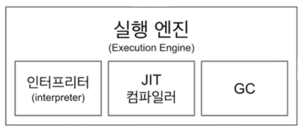

# JVM(JAVA Virtual Machine) # 

## 개념 ##

> #### JAVA는 OS에 종속적이지 않다 ####

자바를 처음 접했을 때 들었던 말입니다. 실제로, 제가 윈도우 환경에서 개발한 프로젝트들을 컴파일해서 리눅스 서버에 올려도 동일한 버전의 자바만 
설치되어 있다면 자연스럽게 동작합니다.
그래서 JVM은 자바 프로그램 실행환경을 만들어주는 소프트웨어라고 할 수 있습니다.
JVM은 JRE에 포함되어 있습니다.

JVM은 어떻게 운영체제에 관계없이 JAVA가 동작하도록 실행환경을 구성하는 건지 알아보겠습니다.
우선 C언어의 경우 윈도우환경과 리눅스환경에서 어떻게 동작하는지 알아보겠습니다.

C언어로 작성된 Test.c 파일을 윈도우 컴파일러가 컴파일을 하면 Test.exe 파일이 생성됩니다.
하지만 Test.exe 파일은 윈도우에서만 동작합니다. 리눅스에서는 동작하지 않습니다. Test.exe를 리눅스 환경에서 실행하려면 리눅스 환경에 맞는 실행파일을
새로 만들어야합니다.

하지만 Java의 경우는 자바 Test.java를 자바 컴파일러로 컴파일하면 Test.class라는 바이트코드 파일이 생성됩니다.
여기서 <strong>.class</strong> 파일은 CPU가 이해하는 기계어와 사람이 작성한 원시코드의 중간 단계정도라고 볼 수 있습니다.
JVM은 이 바이트코드를 이해할 수 있습니다. 그래서 바이트코드를 윈도우 JVM이 윈도우가 이해할 수 있는 기계어로 바꾸고, 리눅스 JVM이 리눅스가 이해할 수 있는 기계어로 바꿔 
서로 다른 환경에서 자바가 실행될 수 있도록 해줍니다.
그렇기 때문에, 자바는 플랫폼에 종속적이지 않지만 JVM은 실행 환경에 맞는 기계어로 바꿔줘야 하므로 플랫폼에 종속적입니다.
그래서 자바를 제공하는 오라클사에서는 대부분의 주요 운영체제뿐만 아니라 웹 브라우저, 스마트폰, 가전기기등의 JVM도 지원하고 있습니다.

 

## 자바 프로그램의 실행 과정 ##

개발자가 .java 파일을 작성하고 컴파일할 때 javac 명령어를 사용합니다. 여기서 javac는 Java Compiler를 의미합니다.
자바 컴파일러에 컴파일 명령을 내리면 .class 파일이 생성됩니다. 여기까지가 컴파일 환경이고 이제 컴파일된 파일을 컴퓨터에서 실행하기 위해서 .class 파일을 클래스 로더가 JVM 내의 런타임 데이터 영역에 로드합니다.
클래스로더는 클래스를 처음으로 참조할 때, 해당 클래스를 로드하고 링크하는 역할을 합니다.
다음에는 JVM내의 실행엔진(Execution Engine)을 통해 기계어로 변경하고 해석하여 실행합니다.

## JVM 동작 방식 ##

### 클래스 로더 ###

자바는 런타임 환경에서 동적으로 클래스를 읽어옵니다. 그렇기 때문에 모든 코드가 JVM가 연결되는 시점은 프로그램이 실행되는 런타임시점입니다.
자바 프로그램의 실행과정에서 클래스로더가 클래스를 링크한다는 말의 의미는 JVM과 .class파일을 연결시켜준다는 의미입니다.
클래스로더는 .class 파일을 Runtime Data Area 에 배치하여 JVM과 .class파일을 연결합니다.
JVM이 실행되면서 OS로부터 메모리를 할당받고, 할당받은 이 영역에 클래스 로더가 바이트코드로 작성된 .class파일을 배치합니다.

### 실행 엔진(Execution Engine) ###

클래스를 실행시키는 역할을 합니다.
클래스 로더가 배치한 .class파일은 Runtime Data Area의 Method Area에 배치됩니다. 이후 JVM은 바이트 코드를 런타임 모듈에 제공합니다.
런타임 모듈은 바이트코드를 명령어 단위로 해석해서 실행합니다. 여기서 바이트코드를 해석하고 실행하는 런타임 모듈을 '실행 엔진'이라고 합니다.
이 때, 인터프리터 방식과 JIT 컴파일 방식을 혼합해서 사용합니다.

#### 인터프리터 ####
바로 위에서 언급한 바이트 코드를 명령어 단위로 해석하고 기계어로 번역해 실행하는 역할을 수행합니다.
하지만 한 줄씩 수행하기 때문에 중복되는 코드를 매번 기계어로 컴파일 하게 되면 비효율적이며 속도가 느립니다.
그래서 중복되는 byte code는 JIT 컴파일러를 사용합니다.

#### JIT(Just In Time) 컴파일러 ####
인터프리터의 효율을 높히기 위해 인터프리터가 반복되는 코드를 발견하면 JIT 컴파일러가 반복되는 코드를 모두 기계어로 번역합니다.(캐싱)
그러면 인터프리터는 이후에 캐싱된 코드를 기계어로 컴파일 할 필요없이 바로 실행을 하면 되기 때문에 효율적입니다.

### 가비지 컬렉터(Garbage Collector) ###
JVM은 런타임 환경에서 더는 사용하지 않는 메모리를 자동으로 회수하여 주는데, 이 역할을 하는 것이 Garbage Collector입니다.
Heap 메모리 영역에 생성된 객체들 중에 더이상 참조되지 않는 객체들을 탐색하여 제거합니다. 이 때, 해당 역할을 하는 시간이 정확히 언제인지 알기는 어렵습니다.
GC 역할을 수행하는 스레드를 제외한 나머지 모든 스레드들은 일시정지 상태가 되는데, 가비지 컬렉터(GC)는 성능을 위해 일시정지가 되는 시간을 최소화시키는 다양한 로직을 가지고 있습니다.

### 런타임 데이터 영역 ###

애플리케이션이 실행될 대 사용하는 데이터들을 적재하는 JVM의 메모리 영역을 Runtime Data Area라고 부릅니다.

여기서 모든 스레드가 공유해서 사용하는 영역은 '힙 영역'과 '메소드 영역'이고, 두 영역은 GC가 메모리를 회수하는 대상입니다.
반대로 스레드마다 개별적으로 하나씩 생성되는 영역은 스택영역과, PC 레지스터, 네이티브 메소드 스택이 있습니다.

#### 메소드 영역 ####
클래스영역 혹은 스태틱 영역이라고 부르기도 합니다. 클래스 정보를 처음 메모리 공간에 올릴 때 초기화되는 대상을 저장하기 위한 메모리 공간입니다.
메소드 영역은 클래스 멤버 변수의 이름, 데이터 타입, 접근 제어자 정보와 같은 필드 정보와 메소드 정보, 데이터 타입정보등이 생성되는 영역입니다.

#### Runtime Constant Pool ####
static 영역에 존재하는 별도의 관리영역입니다.
상수 자료형을 저장하여 참조하고 중복을 막는 역할을 합니다.

#### 힙 영역 ####

객체를 저장하는 가상메모리 공간입니다.
힙 영역은 'new' 키워드로 생성된 객체와 배열이 생성되는 영역이고, GC가 주기적으로 메모리를 청소하는 영역입니다.
클래스 영역에 올라온 클래스들만 객체로 생성할 수 있습니다.

+ Permanent Generation
생성된 객체들의 정보의 주소값이 저장된 공간입니다. 
클래스 로더에 의해 로드된 class, method 등에 대한 Meta 정보가 저장되는 영역입니다.
Reflection을 사용하여 동적으로 클래스를 로드하는 경우에 JVM이 사용합니다.
+ New/Young Genertaion
이곳에 생성된 인스턴트들은 GC에 의해 사라집니다. 생명주기가 짧은 객체를 GC의 대상으로 하는 영역입니다.
여기서 일어나는 가비지 콜렉트를 Minor GC라고 합니다.

  + Eden : 객체들이 최초로 생성되는 공간. 이 영역에 객체가 가득차면 첫번째 가비지 콜렉트가 발생한다. Eden 영역에 있는 값들을 Survivor1 영역에 복사하고 이 영역을 제외한 나머지 객체를 삭제한다.
  + Survivor : Eden에서 참조되는 객체들이 저장되는 공간 

+ Tenured Generation
    + Old : 이곳의 인스턴스들은 추후 GC에 의해 사라집니다. 생명주기가 긴 객체를 GC의 대상으로 하는 영역입니다. 여기서 일어나는 가비지 콜렉트를 Major GC라고 합니다. Minor GC에 비해 속도가 느리다는 특징이 있고, New/Young Area에서 일정시간 참조되고 있는, 살아남은 객체들이 저장됩니다.

#### 스택영역 ####
프로그램 실행과정에서 임시로 할당되었다가 메소드를 빠져나가면 바로 소멸되는 특성의 데이터를 저장하기 위한 영역입니다.
그래서 스택영역은 지역변수, 파라미터, 리턴 값, 연산에 사용되는 임시 값등 메소드 내부에서 사용되는 값들이 생성됩니다.

#### PC 레지스터 ####
PC 레지스터는 Thread가 생성될 때마다 생성되는 영역으로 프로그램 카운터, 즉 현재 스레드가 실행되는 부분의 주소와 명령을 저장하고 있습니다.

#### Native Method Stack ####
자바 프로그램이 컴파일되어 생성되는 바이트코드가 아니라 실제 실행할 수 있는 기계어로 작성된 프로그램을 실행시키는 영역입니다.
그래서 JAVA가 아닌 다른 언어로 작성된 코드를 위한 공간이기도 합니다. C 혹은 C++에서 구현된 일반 프로그램처럼 커널이 스택을 잡아서 독자적으로 프로그램을 실행시킵니다.

