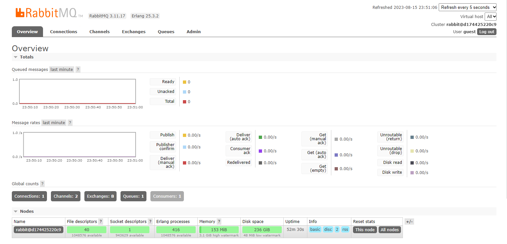
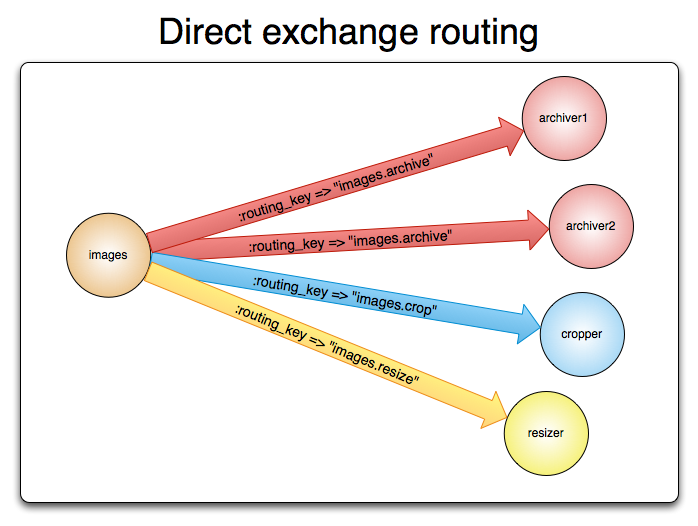
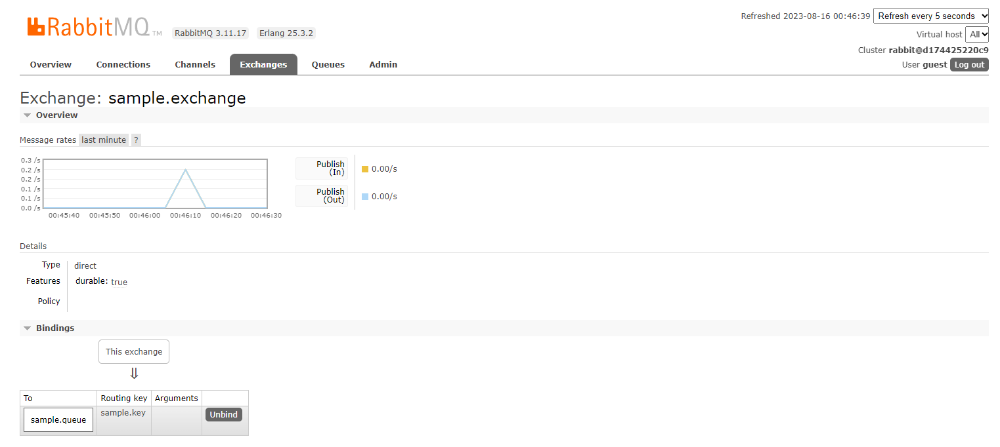
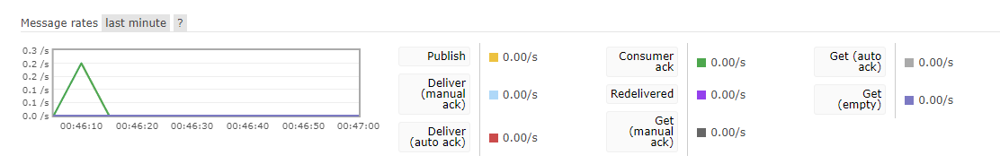

## SpringBoot + RabbitMQ ##

SpringBoot에서 RabbitMQ를 연동한 예제입니다.

<br>
<br>
  

### MQ(Message Queue)의 사용목적 ###
서버가 클라이언트와 동기방식으로만 데이터 통신을 하다보면, 데이터 양이 많아질 경우 병목현상이 발생하여 성능이 저하될 수 있습니다.
그래서 많은 사용자에게 알림을 전송한다거나 메시지를 전송해야하는 기능이 필요한 경우 RabbitMQ와 같은 MQ(MessageQueue)를 사용하는 것을 고려해볼 수 있습니다.
기본적으로 대부분의 MQ는 메시지를 생산하는 Producer와 메시지를 소비하는 Consumer가 존재합니다.
Producer는 메시지를 생산해서 큐에 삽입합니다. 그리고 큐와 연결된 Consumer는 큐에서 메시지를 꺼내어 소비합니다.
이 과정에서 다양한 기능적.성능적 요구로인해 consumer가 여러개일 때 메시지를 어떻게 소비할 것인지, 특정한 주제에 대한 내용만 소비한다거나, 여러개의 큐를 두는 경우등 다양한 고민을 해볼 수 있지만 
이번 예제에서는 큰 틀에서 전체적인 구조에 대해서만 구현하도록 하겠습니다. 

전체적인 프로세스는 다음과 같습니다.
REST API 형태로 API 요청이 들어오면 메시지를 생성해서 큐에 입력하고, 리스너가 큐에서 메시지를 소비하는 프로그램의 구현을 목표로 진행할 것입니다.
RabbitMQ는 docker-desktop의 ubuntu 환경에서 실행하였습니다.

ubuntu 터미널에서 아래와 같은 명령어를 입력합니다.
 

```shell
docker run -d --name rabbitmq -p 5672:5672 -p 15672:15672 --restart=unless-stopped rabbitmq:management
```
RabbitMQ 이미지가 설치되어있지 않더라도 docker는 자동으로 대표이미지를 찾아서 설치해주므로 곧바로 컨테이너를 실행하였습니다.

입력한 명령어를 하나씩 살펴보면,  
rabbitmq라는 이름의 컨테이너를 내부포트와 외부포트 모두 5672로 설정하여 생성하고 동시에 접속하고 실행합니다.
-d 옵션은 컨테이너를 일반 프로세스가 아닌 데몬프로세스로 실행하여 백그라운드 환경에서도 동작하도록 하는 옵션입니다.
--restart 옵션은 컨테이너 종료시, 재시작 정책을 어떻게 할것인지 설정하는 옵션입니다. "unless-stopped"는 컨테이너가 정지상태가 아니라면 항상 재시작한다는 의미입니다.

15672 포트는 rabbitMQ의 동작을 모니터링할 수 있도록 제공되는 웹페이지 포트입니다. 
아래와 같은 웹페이지에 접속이 가능합니다.



이 화면을 보기 전에 username과 password를 입력하는 페이지가 있는데, 별도의 설정을 하지 않는경우 guest/guest가 기본값입니다.


<br>

### Message Producer&Consumer ###

이제 메시지를 생산하고 큐에 입력하는 producer 코드를 작성해보겠습니다.
SpringBoot와 연동해서 구현할 것이므로 먼저 관련 의존성을 추가해줍니다.

```groovy
dependencies {
    implementation 'org.springframework.boot:spring-boot-starter-amqp'
    implementation 'org.springframework.boot:spring-boot-starter-web'
    compileOnly 'org.projectlombok:lombok'
    annotationProcessor 'org.projectlombok:lombok'
    testImplementation 'org.springframework.boot:spring-boot-starter-test'
    testImplementation 'org.springframework.amqp:spring-rabbit-test'
}
```
SpringBoot에서는 메시지 큐를 관리하는 솔루션으로 AMQP 프토토콜을 사용합니다.
AMQP 프로토콜은 표준화된 메시징 프로토콜로, 다른 메시징 시스템과 통합하거나 교체할 때 유용하고 확장도 쉽기때문에 메시징 프로토콜로 많이 사용됩니다.

다음은 RabbitMQ 접속정보를 설정하도록 하겠습니다.

```properties
spring.rabbitmq.host=localhost
spring.rabbitmq.port=5672
spring.rabbitmq.username=guest
spring.rabbitmq.password=guest
rabbitmq.queue.name=sample.queue
rabbitmq.exchange.name=sample.exchange
rabbitmq.routing.key=sample.key
```

rabbitMQ는 별도의 설정을 하지 않으면 기본적으로 5672포트를 사용합니다. 그리고 docker에서 접속포트를 5672로 설정했기때문에 Spring 에서도 동일하게 맞춰주어야 합니다.
queue와 exchange, 그리고 routing key는 임의로 설정하였습니다. 여기서 정한 이름에 맞춰 생성됩니다.

다음은 Spring 실행시에 RabbitMQ에 접속하도록 설정클래스를 만들어주겠습니다.
```java
@Configuration
public class RabbitMQConfig {

    @Value("${spring.rabbitmq.host}")
    private String rabbitmqHost;

    @Value("${spring.rabbitmq.port}")
    private int rabbitmqPort;

    @Value("${spring.rabbitmq.username}")
    private String rabbitmqUsername;

    @Value("${spring.rabbitmq.password}")
    private String rabbitmqPassword;

    @Value("${rabbitmq.queue.name}")
    private String queueName;

    @Value("${rabbitmq.exchange.name}")
    private String exchangeName;

    @Value("${rabbitmq.routing.key}")
    private String routingKey;

    @Bean
    public Queue queue() {
        return new Queue(queueName);
    }

    @Bean
    public DirectExchange exchange() {
        return new DirectExchange(exchangeName);
    }

    @Bean
    public Binding binding(Queue queue, DirectExchange exchange) {
        return BindingBuilder.bind(queue).to(exchange).with(routingKey);
    }

    @Bean
    public ConnectionFactory connectionFactory() {
        CachingConnectionFactory connectionFactory = new CachingConnectionFactory();
        connectionFactory.setHost(rabbitmqHost);
        connectionFactory.setPort(rabbitmqPort);
        connectionFactory.setUsername(rabbitmqUsername);
        connectionFactory.setPassword(rabbitmqPassword);

        return connectionFactory;
    }

    @Bean
    public RabbitTemplate rabbitTemplate(ConnectionFactory connectionFactory) {
        RabbitTemplate rabbitTemplate = new RabbitTemplate(connectionFactory);
        rabbitTemplate.setMessageConverter(jackson2JsonMessageConverter());
        return rabbitTemplate;
    }

    @Bean
    SimpleRabbitListenerContainerFactory simpleRabbitListenerContainerFactory(ConnectionFactory connectionFactory) {
        final SimpleRabbitListenerContainerFactory factory = new SimpleRabbitListenerContainerFactory();
        factory.setConnectionFactory(connectionFactory);
        factory.setMessageConverter(jackson2JsonMessageConverter());

        return factory;
    }

    @Bean
    public MessageConverter jackson2JsonMessageConverter() {
        return new Jackson2JsonMessageConverter();
    }
}
```

프로젝트 실행 시, 각각의 큐,익스체인지,바인딩을 생성해야 API 요청이 들어왔을 때, 처리를 할 수 있으므로 Bean으로 등록해주었습니다.
exchange는 메시지를 생산하는 생산자와 큐 사이에서 큐에 어떤식으로 메시지를 전달할지 처리하는 역할을 수행합니다.
DirectExchange는 라우팅 키를 기반으로 특정한 큐에 메시지를 하나씩 전달하는 가장 기본적인 exchange입니다.



메시지를 처리할 때, 매번 RabbitMQ 연결 객체를 호출해서 사용하는 것은 비효율적이기 때문에 RabbitTemplate 객체를 생성하고 빈으로 등록해주면, 다음부터는 RabbitTemplate을 통해서
RabbitMQ와 통신할 수 있습니다.

SimpleRabbitListenerContainerFactory는 메시지를 소비할 때, 사용되는 객체로 빈으로 등록해두면 @RabbitListener 어노테이션을 붙이 메소드에서 메시지를 소비할 수 있습니다.

```java
@RequiredArgsConstructor
@Service
public class MessageService {

    @Value("${rabbitmq.exchange.name}")
    private String exchangeName;

    @Value("${rabbitmq.routing.key}")
    private String routingKey;


    private final RabbitTemplate rabbitTemplate;


    public void sendMessage(MessageDto messageDto) {
        rabbitTemplate.convertAndSend(exchangeName, routingKey, messageDto);
        System.out.println("send!");
    }

    @RabbitListener(queues = "sample.queue")
    public void receiveMessage(MessageDto messageDto) {
        System.out.println(messageDto.toString());
        System.out.println("메시지 consume 성공");
    }
}
```
sendMessage 메소드에서는 템플릿에서 제공하는 convertAndSend 메소드에 메시지를 전달할 exchange와 어떤 큐에 메시지를 전달할지 결정하는 routing key,
그리고 전달하고자 하는 메시지를 인자로 넘깁니다.

receiveMessage 메소드에는 @RabbitListener을 달아주고, 구독할 큐의 이름을 입력합니다.
이제 receiveMessage 메소드는 consumer의 역할을 수행합니다. 메시지의 내용을 출력하고 완료 메시지를 보냅니다.

이제 실행해서 메시지를 발행해 보겠습니다.

Postman을 통해서 localhost:8080/message의 주소로 아래의 값을 전송하겠습니다.

```json
{
    "title" : "qwe",
    "body" : "qwe"
}
```






exchange와 queue에 메시지가 잘 전달된 것을 확인할 수 있습니다.
그리고 실행중인 application에 콘솔창을 보면 전달한 메시지가 출력되는 모습을 확인할 수 있습니다.


### 마무리 ###

여기까지해서 간단한 SpringBoot와 RabbitMQ를 연동하는 어플리케이션을 만들어보았습니다.
이번 프로젝트에서는 가장 기초적인 형태로 구현하였지만 실제로 서비스를 할 때는 훨씬 더 복잡한 요구사항이 있기 때문에 좀 더 많은 부분을 고려해야겠지만,
전체적인 구조를 학습하는 목적은 충분히 달성한 것 같습니다.
오늘 공부한 내용을 기반으로 하여 응용해 나가 더 구체적이고 복잡한 요구사항을 처리하면 좋을 것 같습니다.
