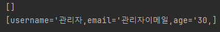

## 아이템 18 . 상속보다는 컴포지션을 사용하라 

상위클래스와 하위클래스가 순수한 is a 관계가 아니라면(심지어 is a 관계더라도), 상속을 하기전에 컴포지션의 활용을 고민해봐야 겠다는 배움을 얻은 파트입니다.
이펙티브 자바에서는 `상속은 강력하지만 캡슐화를 해친다는 문제가 있다.` 라고 하며 상속을 사용할 때 고려해야 할 부분을 알려주고 있습니다.

- 상속하려는 하위 클래스가 정말로 상위 클래스의 하위타입인가?(is-a 관계인가?)
- 확장하려는 클래스의 API에 아무런 결함이 없는가?
- 결함이 있다면, 이 결함이 여러분 클래스의 API까지 전파되어도 괜찮은가?

그래서, 이펙티브 자바의 예제를 응용해 실제 서비스에서 있을 것 같은 상황을 상상해, 컴포지션으로 구현한 예제입니다.
공공기관 프로젝트나 다양한 권한이 존재하는 프로젝트의 경우, 여러 종류의 관리자가 존재할 수 있습니다.
각각의 관리자들은 다양한 권한을 가지며, 공통적으로 가지는 권한과 차별화된 권한이 존재하기도 합니다.
차별화된 관리자를 '슈퍼 관리자'라고 하고 공통적으로 가지는 권한만 가진 관리자를 '관리자'라고 표현하고 이것을 코드로 구현한다고 생각해보았습니다.

이펙티브 자바에서 저술한대로 슈퍼관리자는 관리자와 정확한 is a 관계가 아닙니다.
슈퍼관리자가 관리자의 기능을 포함하는 has a 관계에 더 가깝습니다.
구체적으로 기능을 하나 상상해본다면 관리자의 경우 전체 회원 조회를 하면 관리자를 제외한 순수한 회원들만 조회할 수 있고, 슈퍼 관리자의 경우 관리자를 포함한 모든 회원을 조회할 수 있다고 생각해보았습니다.
물론 실제 상황에서는 컴포지션이 아니라 더 다양한 방법을 고민해 볼 수 있겠지만, 이번에는 컴포지션을 통해서 구현하였습니다.

먼저 관리자들이 공통적으로 할 수 있는 일들에 대해 인터페이스로 정의하겠습니다.
```java
public interface AdminInterface<E> {
    void addUser(User user);
    void removeUser(User user);
    User getUser(int idx);
    List<E> getAll();
    E getAdmin();
}
```

그리고 일반 관리자의 경우, 인터페이스를 구현하여 메소드의 내용을 채워줍니다.
```java
public class Admin extends User implements AdminInterface<User>  {
    List<User> users = new ArrayList<>();
    @Override
    public void addUser(User user) {
        users.add(user);
    }

    @Override
    public void removeUser(User user) {
        users.remove(user);
    }

    @Override
    public User getUser(int idx) {
        return users.get(idx);
    }

    @Override
    public List<User> getAll() {
        return users;
    }

    @Override
    public Admin getAdmin() {
        return this;
    }
}
```

일반 관리자의 경우 getAll() 메소드를 호출할 때, 회원들의 정보를 가지고 있는 users를 반환합니다.
하지만 슈퍼관리자의 경우 getAll() 메소드를 호출할 때, 관리자를 포함한 정보를 반환해야합니다.
(운영중인 서비스에서는 DB를 통해 데이터를 조회하겠지만, 예제에서는 간단힌 필드로 선언해서 조작하였습니다.)
여기서, admin 클래스를 상속하여 getAll 메소드를 재정의하지 않고, 컴포지션을 통해 상위클래스에 새로운 매서드가 추가되더라도 영향을 받지 않도록 할것입니다.

```java
    private final AdminInterface<E> admin;

public ForwardingAdmin(AdminInterface<E> admin) {
    this.admin = admin;
}

public void addUser(User user) {
    admin.addUser(user);

}


public void removeUser(User user) {
    admin.removeUser(user);
}


public User getUser(int idx) {
    return admin.getUser(idx);
}


public List<E> getAll() {
    return admin.getAll();
}


public E getAdmin() {
    return admin.getAdmin();
}

@Override
public boolean equals(Object o) {
    return admin.equals(o);
}

@Override
public int hashCode() {
    return admin.hashCode();
}

@Override
public String toString() {
    return admin.toString();
}
```

```java
public class SuperAdmin<E> extends ForwardingAdmin<E> {

    public SuperAdmin(AdminInterface admin) {
        super(admin);
    }

    @Override
    public List<E> getAll() {
        List<E> users = super.getAll();
        users.add(super.getAdmin());
        return users;
    }
}
```
다양한 관리자타입이 추가되더라도 유연하게 대처할 수 있도록, AdminInterface를 필드로 선언하고, 메소드들은 AdminInterface를 구현한 구현체라면 필수적으로 구현해야하는 메소드를 사용하여 이 기능이 필요한 다른 타입의 관리자도 사용할 수 있도록 해줍니다.
이제 일반 관리자와 슈퍼관리자의 getAll 메소드 호출결과를 출력해보겠습니다.

```java
        Admin defaultAdmin = new Admin("관리자","관리자이메일",30);
        ForwardingAdmin<User> superAdmin = new SuperAdmin<>(defaultAdmin);

        System.out.println(defaultAdmin.getAll());
        System.out.println(superAdmin.getAll());
```



일반관리자의 경우는 회원들에 대한 정보만을 호출합니다. 하지만 현재 회원을 아무도 추가하지 않았기 때문에 비어있는 list가 출력됩니다.
하지만 슈퍼 관리자의 경우, 자기 자신도 한 명의 회원으로 취급하기 때문에, 생성한 관리자 정보가 나타나는 것을 알 수 있습니다.